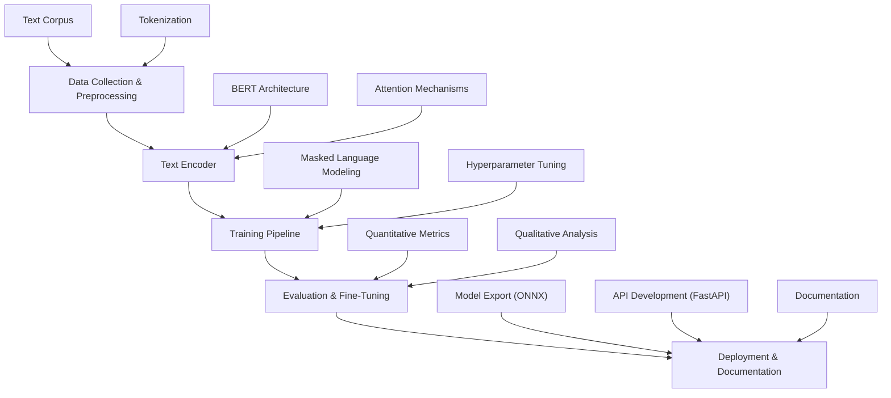
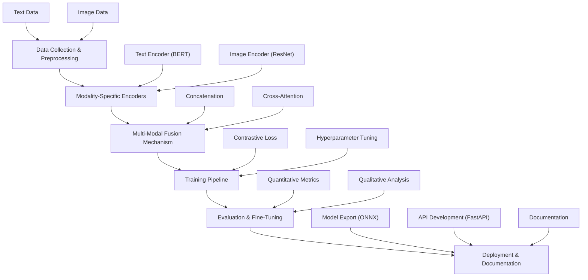

# Transparent Multi-Modal AI System 🔍🖼️

A BERT-ResNet fusion model with built-in explainability through attention visualization. Processes text-image pairs while exposing decision-making mechanisms via heatmaps and token highlighting.

**Begin [HERE](https://github.com/ashworks1706/ExplainableAI/blob/main/tutorial.ipynb)!**

## 🚀 Features

- **Dual Encoder Architecture**: BERT (text) + ResNet (image) with cross-attention fusion
- **Explainability Layer**: Real-time visualization of:
  - Image regions influencing decisions (OpenCV heatmaps)
  - Key text tokens (HTML/CSS highlighting)
  - Cross-modal attention patterns
- **CLIP-style Training**: Contrastive loss for alignment learning
- **Production Ready**: ONNX export & FastAPI deployment

## 📦 Installation

```
git clone https://github.com/ashworks1706/multimodal-llm
cd multimodal-llm
pip install -r requirements.txt
```

## 🛠️ Usage

1. **Data Preparation** (COCO dataset):

```
python data/preprocess_coco.py --images_dir /data/images/images --annotations /data/images/annotations
```

2. **Training**:

```
python training/train.py --batch_size 64 --lr 1e-5 --use_amp
```

3. **Interactive Demo**:

```
python demo/app.py
```

## 🧠 Project Structure

```
├── models/              # Encoders & fusion layers
├── data/                # Processing scripts
├── training/            # Contrastive loss implementation
├── explainability/      # Attention visualization tools
├── demo/                # Gradio interface
```

## 📐 Model Architecture

### Text Modal LLM



*Single encoder system with self-attention mechanisms and explainability features*

### Multimodal LLM



*Dual encoder system with cross-attention fusion and visualization hooks*

## 🏋️ Training Details

| Hyperparameter      | Value        |
| ------------------- | ------------ |
| Batch Size          | 64-128       |
| Learning Rate       | 1e-5 to 1e-4 |
| Embedding Dimension | 512          |
| Temperature (τ)    | 0.07         |

---

### TODO

* [X] Decide the project structure and data to use
* [X] Setup repository, project and environment
* [ ] Phase 1

  * [X] Perform data analysis on textual data
  * [ ] Layout the key foundational points of modern transformer model and their difference from older models, provide examples
  * [ ] Perform different techniques in the architecture with test data
  * [ ] Train the model
  * [ ] Evaluate the model and explain why's of everything
  * [ ] Research and perform better techniques on the model while documenting
  * [ ] visualize the model attention via custom UI libraries
  * [ ] Finsh off with text model and save best to models
* [ ] Phase 2

  * [ ] Introduction to multimodal, visualize model
  * [ ] Perform data analysis on image-text pair data
  * [ ] Layout the key foundational points of modern transformer model and their difference from older models, provide examples
  * [ ] Perform different techniques in the architecture with test data
  * [ ] Train the model
  * [ ] Evaluate the model and explain why's of everything
  * [ ] Research and perform better techniques on the model while documenting
  * [ ] visualize the model attention via custom UI libraries
  * [ ] Finsh off with text model and save best to models
* [ ] Final edits, errors and notes
* [ ] DONE!

## 💎 Collaborators

Feel free to reach out on [discord](https://discord.gg/u6Gv4Rvr)!
