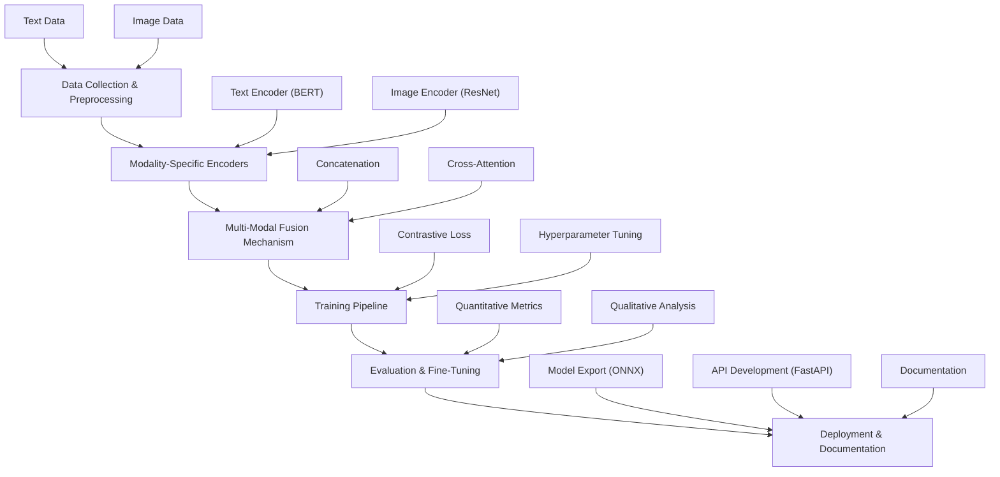

# Transparent Multi-Modal AI System 🔍🖼️

A BERT-ResNet fusion model with built-in explainability through attention visualization. Processes text-image pairs while exposing decision-making mechanisms via heatmaps and token highlighting.

## 🚀 Features
- **Dual Encoder Architecture**: BERT (text) + ResNet (image) with cross-attention fusion
- **Explainability Layer**: Real-time visualization of:
  - Image regions influencing decisions (OpenCV heatmaps)
  - Key text tokens (HTML/CSS highlighting)
  - Cross-modal attention patterns
- **CLIP-style Training**: Contrastive loss for alignment learning
- **Production Ready**: ONNX export & FastAPI deployment

## 📦 Installation
```
git clone https://github.com/ashworks1706/multimodal-llm
cd multimodal-llm
pip install -r requirements.txt
```

## 🛠️ Usage
1. **Data Preparation** (COCO dataset):
```
python data/preprocess_coco.py --images_dir /data/images/images --annotations /data/images/annotations
```

2. **Training**:
```
python training/train.py --batch_size 64 --lr 1e-5 --use_amp
```

3. **Interactive Demo**:
```
python demo/app.py
```

## 🧠 Project Structure
```
├── models/              # Encoders & fusion layers
├── data/                # COCO processing scripts
├── training/            # Contrastive loss implementation
├── explainability/      # Attention visualization tools
├── demo/                # Gradio interface
└── docs/                # Architecture diagrams & blog post
```

## 📐 Model Architecture



*Dual encoder system with cross-attention fusion and visualization hooks*

## 🏋️ Training Details
| Hyperparameter      | Value        |
|---------------------|--------------|
| Batch Size          | 64-128       |
| Learning Rate       | 1e-5 to 1e-4 |
| Embedding Dimension | 512          |
| Temperature (τ)     | 0.07         |

## 🎥 Demo Screenshot


## 🤝 Contributing
PRs welcome! See [CONTRIBUTING.md](CONTRIBUTING.md) for guidelines.

---
